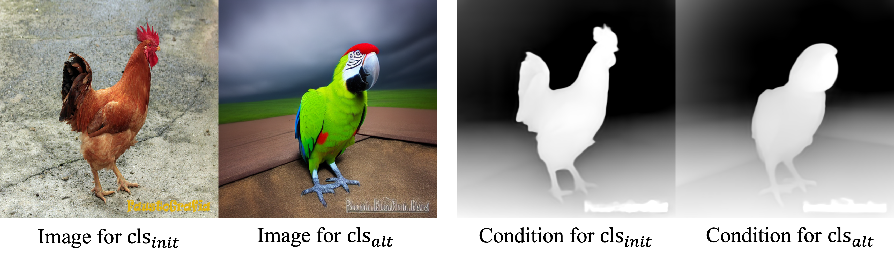

# SmartControl: Enhancing ControlNet for Handling Rough Visual Conditions（ECCV2024）
[](http://arxiv.org/abs/2404.06451.pdf)
[](https://smartcontrolnet.github.io/)

---


## 1. Abstract


For handling the disagreements between the text prompts and rough visual conditions, we propose a novel text-to-image generation method dubbed SmartControl, which is designed to align well with the text prompts while adaptively keeping useful information from the visual conditions. Specifically, we introduce a control scale predictor to identify conflict regions between the text prompt and visual condition and predict spatial adaptive scale based on the degree of conflict. The predicted control scale is employed to adaptively integrate the information from rough conditions and text prompts to achieve the flexible generation.

## Release
- [2024/9/4] 🔥 Add train datasets and models for scribble, canny and seg conditions.
- [2024/7/7] 🔥 Add train datasets and code for training.
- [2024/3/31] 🔥 We release the code and models for depth condition.


## Installation

```
pip install -r requirements.txt
# please install diffusers==0.25.1 to align with our forward
```

## Unaligned Text-Condition Dataset

If you want to train, you can visit [this page](https://drive.google.com/drive/folders/1DpkMZkpq512SzeFt_MzfZ7LKqXF8WZ8-?usp=drive_link) to download our dataset for depth condition. Otherwise, you can directly refer to the testing section.
We also provide the datasets for other conditions in [here](https://pan.baidu.com/s/1Hd69Kpi_K_dbn3vZpSYnjA?pwd=vnn3). 

#### Data Format

The data is structured as follows:

- **Image for <$\texttt{cls}_{init}$> vs. Image for <$\texttt{cls}_{alt}$>**
- **Condition for <$\texttt{cls}_{init}$> vs. Condition for  <$\texttt{cls}_{alt}$>**

#### Example


## Download Models

you can download our control scale predictor models from [depth condition](https://drive.google.com/file/d/1iu7eE-XtxFkIupvJyesQnustuujXAW61/view?usp=drive_link) and [other conditions]( https://pan.baidu.com/s/1JvIn_IzfASiBUpzRi4s5oQ?pwd=2fe8). To run the demo, you should also download the following models:
- [stabilityai/sd-vae-ft-mse](https://huggingface.co/stabilityai/sd-vae-ft-mse)
- [SG161222/Realistic_Vision_V5.1_noVAE](https://huggingface.co/SG161222/Realistic_Vision_V5.1_noVAE)
- [ControlNet models](https://huggingface.co/lllyasviel)
- [realisticvision-negative-embedding](https://civitai.com/models/36070/negative-embedding-for-realistic-vision-v20)


## How to Test


- If you are interested in SmartControl, you can refer to [**smartcontrol_demo**](smartcontrol_demo.ipynb)

    <!-- The result for depth conditions -->


- For integration our SmartControl to IP-Adapter, please download the IP-Adapter models and refer to [**smartcontrol_ipadapter_demo**](smartcontrol_ipadapter_demo.ipynb)

    ```
    # download IP-Adapter models
    cd SmartControl
    git lfs install
    git clone https://huggingface.co/h94/IP-Adapter
    mv IP-Adapter/models models
    ```
    
## How to Train

Our training code is based on the official ControlNet code. To train on your datasets:

1. Download the training datasets and place them in the `train\data` directory.
2. Download the pre-trained models:
   - [Stable Diffusion](https://huggingface.co/runwayml/stable-diffusion-v1-5/blob/main/v1-5-pruned.ckpt)
   - [ControlNet](https://huggingface.co/lllyasviel/ControlNet-v1-1/blob/main/control_v11f1p_sd15_depth.pth)
   
   Place these models in the `train\models` directory.

To start the training, run the following commands:

```
cd train
python tutorial_train.py
```


## Acknowledgements 
Our codes are built upon [ControlNet](https://github.com/lllyasviel/ControlNet-v1-1-nightly) and [IP-Adapter](https://github.com/tencent-ailab/IP-Adapter).


## Citation
If you find SmartControl useful for your research and applications, please cite using this BibTeX:
```bibtex
@article{liu2024smartcontrol,
  title={SmartControl: Enhancing ControlNet for Handling Rough Visual Conditions},
  author={Liu, Xiaoyu and Wei, Yuxiang and Liu, Ming and Lin, Xianhui and Ren, Peiran and Xie, Xuansong and Zuo, Wangmeng},
  journal={arXiv preprint arXiv:2404.06451},
  year={2024}
}
```
